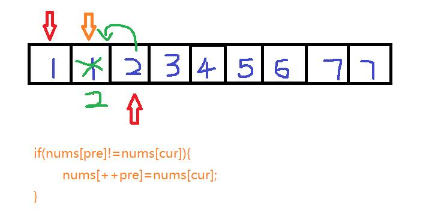

## 题目 ##
Given a sorted array, remove the duplicates in place such that each element appear only once and return the new length.

Do not allocate extra space for another array, you must do this in place with constant memory.

For example,
Given input array nums = [1,1,2],

Your function should return length = 2, with the first two elements of nums being 1 and 2 respectively. It doesn't matter what you leave beyond the new length.
## 关键点 ##
1.数组是有序的
2.空间效率为O(1),不能重新分配一和数组来进行操作

## 解题思路 ##
要从数组中去除重复项，而且是在一个排好序的数组中。那么可以选择设置两个指针（快慢指针）来寻找重复项。
指针1：记录不含重复元素数组长度
指针2：遍历整个数组

指针1如何记录不含重复元素数组长度？
当 指针1所指的元素nums[pre] `不等于` 指针2所指的元素时nums[cur]，将nums[cur]的值等于num[++pre]。


```c++
class Solution {
public:
    int removeDuplicates(vector<int>& nums) {
        //异常情况处理
        if(nums.size()==0) return 0;
        
        //设定两个指针，一个用来记录不重复数组长度，一个用来遍历数组
        int pre=0,cur=0;
        for(;cur<nums.size();cur++){
            if(nums[pre]!=nums[cur]){
                nums[++pre]=nums[cur];
            }
        }
        return pre+1;
    }
};
```
