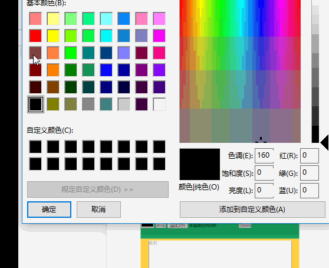

# 优化聊天室的一些新Get的技巧
## 调色盘调用

```html
<input type="color" placeholder="#000" title="font color">
```
效果图如下：


## 打开新Tab页面图片预览

```js
_DisplayImage:(user,imgData,color)=>{
    var userMsg=document.getElementById('recv-area'),
        newMsg=document.createElement('p')
    newMsg.style.color=color||"#000"
    newMsg.innerHTML=user+'<a href="' + imgData + '" target="_blank"></a>'
    userMsg.appendChild(newMsg)
    user.scrollTop=userMsg.scrollHeight  
    
}
```