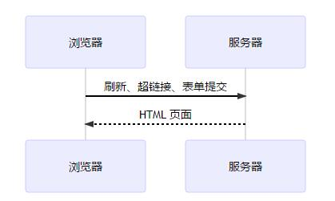
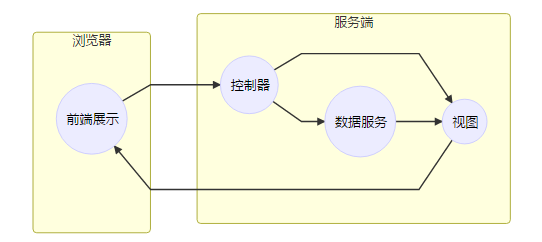
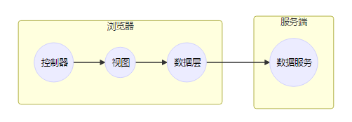

## 前言 ##
最近在学习Vue的时候经常遇到 `单页应用` 这个概念，今天特意去查了一下发现自己所理解的完全是南辕北辙，所以特意记录一下，加深对这个概念的理解

## 何为单页应用 ##
单页应用SPA**（Singel Page Web Application）**。根据维基百科的定义：SPA是一种 `网页应用程序`或`网站`，适合单个网页，目的是提供一个和桌面应用程序相似的用户体验。在一个单页应用中，无论是所需要的代码是HTML、JavaScript还是CSS都在一次页面加载中获取，[1]或者通常根据用户动作动态加载合适的资源并按需要加入到网页中。
## 传统网页应用 ##
**上面的概念还是有点难理解或者和实际联系起来，下面通过联系实际应用说明一下。**
我们先从历史讲起,传统网页的应用是这个样子的：

当然这也不能算是历史，毕竟目前大多数网页还是运用这样的模式。
**
单个HTML页面作为功能元件，通过刷新、超链接、表单提交等方式，组合排列这些HTML页面，来为用于提供服务。也就是说，在传统的网页应用中，浏览器更多的是充当一种展示层， 路由处理、 服务调用、 页面跳转流程 都交给服务端来做。
**
**
简单点讲就是，MVC都交给服务端来做（Ajax除外）.View层作为用户界面通过网络发送到浏览器，作为UI与用户交互
**

特点如下
>- **重服务端**：由于 MVC 都存在于服务器上，因此这类应用在开发资源和开发的重心都偏向后端，往往是后端工程师来主导整个项目开发。
>- **页面刷新频繁**

## 单页应用的特点 ##
了解的传统网页应用的特点和行为，我们可以对比的看待单页应用

**
单页应用将MVC前置到浏览器
**
>- **控制器前置：**单页应用将路由处理放在浏览器，即在浏览器端直接响应浏览器地址变化，分发到对用的路由，向用户呈现对应的界面
>- **以小块组件为功能元件：**类似于传统网页中的 `Ajax组件`，单页应用以小的组件为功能元件，在路由变化时不再刷新整个页面，而是组合这些小的组件，替换变化的部分
>- **数据层前置：**与Ajax组件有一个明显的区别的是，单页应用在浏览器端通常`有一层 实实在在的数据`，而`服务端`则退化成了`完全的数据API`。**浏览器端的数据层会封装服务端API，供上层试图调用**

## 单页应用的优缺点 ##
优点：
>- **无刷新体验：** 路由分发直接在浏览器端完成,页面不需要刷新，对用户的响应十分及时
>- **完全的前端组件化：**前端开发不再以页面为单位,更多地采用组件化的思想,代码结构和组织方式更加规范化,便于修改和调整
>- **API共享:**如果你的服务是多端的(浏览器端、Android、ios、微信等),单页应用的模式便于你在多个端共用API,可以显著减少服务端的工作量。容易变化的 UI 部分都已经前置到了多端，只受到业务数据模型影响的 API，更容易稳定下来，便于提供鲁棒的服务
>- **组件共享:**在某些对性能体验要求不高的场景，或者产品处于快速试错阶段，借助于一些技术（Hybrid、React Native），可以在多端共享组件，便于产品的快速迭代，节约资源

缺点：
>- **首次加载大量资源：**要在一个页面上为用户提供产品的所有功能，在这个页面加载的时候，首先要加载大量的静态资源，这个加载时间相对比较长
>- **较高的前端开发门槛**
>- **不利于SEO:**单页页面，数据在前端渲染，就意味着没有 SEO，或者需要使用变通的方案

[参考资料]寸志：
http://island205.github.io/Single-Page-App-Break/%E7%AC%AC01%E7%AB%A0%20%E4%BD%95%E4%B8%BA%E5%8D%95%E9%A1%B5%E5%BA%94%E7%94%A8.html

