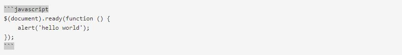
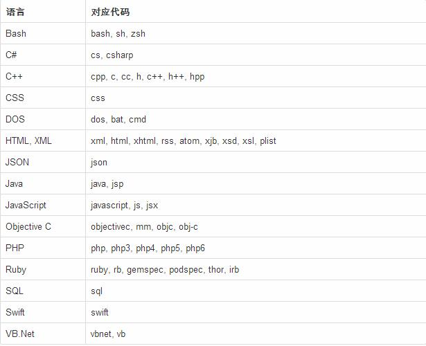
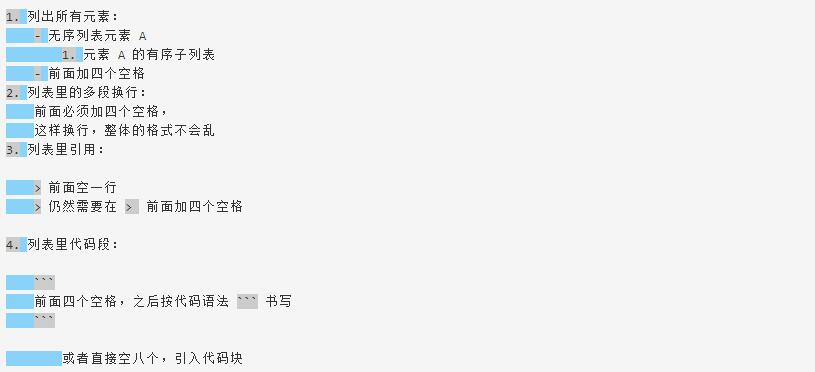
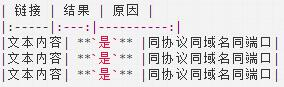

## 摘要 MarkDown ##
**<p style="color:#15A05D;display：block"> 本文分别从两个方面大概讲解MarkDown，让你对MarkDown有一个初步的了解。第一部分是认识MarkDown，了解一下其定义和优点。第二部分讲解的基本语法。分别从代码高亮、标题大小、粗斜体、网页/文字链接、列表、如何加入图片、扩展、公式等七个方面展开讲解</p>**


## 认识 MarkDown

>MarkDown是一种轻量级 **[标记语言]** ，他的优点很多，其目标就是实现 **[易读易写]**常用的标记符号也不超过十个，这种相对于更为复杂的 HTML 标记语言来说，Markdown 可谓是十分轻量的，学习成本也不需要太多，且一旦熟悉这种语法规则，会有一劳永逸的效果。


## 基本技巧 ##

###  1.高亮 ###
如果只想高亮某个函数名或者关键字，可以使用 \`function_name()\` 实现也可以使用包裹一段代码，并指定一种语言


(图1-1)

转义如下：
```javascript
$(document).ready(function () {
    alert('hello world');
});
```


**<p style="color:#DE5145; display：block;">在使用hexo写博文时将 [javascript] 可以修改成任意语言来显示相应语言的代码 （如图1-1）</p>**


**常用语言对应表**



-------

### ** 2.标题 **

文章内容较多时，可使用标题分段
>- 标题1
>- \======
>+ 标题2
>+ \-----
>* \## 大标题 ##
>* \### 小标题 ###

-----

### ** 3.粗斜体**
>- \*斜体文本*  <=>  \_斜体文本_
>+ \*\*粗体文本** <=>   \_\_粗体文本__
>* \*\*\*粗斜体文本*** <=>   \_\_\_粗斜体文本___

----
### ** 4.链接**

>- 文字链接： \[链接名称](http://链接网址)
>+ 网页链接： \<http://链接网址>

-----

### ** 5.列表**
**普通无序列表**

>- 列表文本前使用 [减号+空格]
>+ 列表文本前使用 [加号+空格]
>* 列表文本前使用 [星号+空格]

**普通有序列表**
>1. 列表前使用 [数字+空格]
>2. 我们会自动帮你添加数字
>7. 不用担心数字不对，显示的时候我们会自动把这行的 7 纠正为 3

**列表嵌套**



### ** 6.图片**
（添加图片格式）通过以下方式引入图片：
``

**<p style="color:#DE5145;display：block">如何在hexo博文中添加图片呢？具体请移步至：`http://www.jianshu.com/p/c2ba9533088a`</p>**


------

### ** 7.扩展**
支持 **jsfiddle**、**gist**、**runjs**、优酷视频，直接填写 url，在其之后会自动添加预览点击会展开相关内容。

```http
http://{url_of_the_fiddle}/embedded/[{tabs}/[{style}]]/
https://gist.github.com/{gist_id}
http://runjs.cn/detail/{id}
http://v.youku.com/v_show/id_{video_id}.html
```

-----

### ** 8.公式**
当你需要在编辑器中插入数学公式时，可以使用两个美元符 **$$** 包裹 **TeX** 或 **LaTeX** 格式的数学公式来实现。提交后，问答和文章页会根据需要加载 **Mathjax** 对数学公式进行渲染。如：

```c
$$ x = {-b \pm \sqrt{b^2-4ac} \over 2a}. $$

$$
x \href{why-equal.html}{=} y^2 + 1
$$
```
**同时也支持 HTML 属性，如：**
```c
$$ (x+1)^2 = \class{hidden}{(x+1)(x+1)} $$

$$
(x+1)^2 = \cssId{step1}{\style{visibility:hidden}{(x+1)(x+1)}}
$$
```

------

### ** 9.表格绘制**
**<p style="color:red;display：block">注意！！ MarkDown绘制表格一定要与上面的文字空一行，否则无法转义</p>**


输出结果：

| 链接 | 结果 | 原因 |
|:-----|:---:|----------:|
|文本内容| **`是`** |同协议同域名同端口|
|文本内容| **`是`** |同协议同域名同端口|
|文本内容| **`是`** |同协议同域名同端口|

- `冒号的位置决定表格内的文本对齐方式`，有 `水平居中`，`左对齐`，`右对齐` 三种
- 每列的宽度是根据对应列里最长的文本来决定的

-----

文章来源：`https://segmentfault.com/markdown`
`http://www.jianshu.com/p/1e402922ee32/`