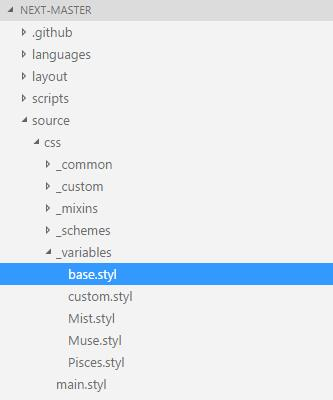

## 修改 [字体] 大小及颜色 ##
`next` 主题默认字体大小是14px，根据官方文档：
http://theme-next.iissnan.com/theme-settings.html#fonts-customization
解决 Google Fonts API 不稳定的问题。`[温馨提示：重点在后面后面哦]`
```javascript
font:
  enable: true

  # 文章字体
  posts:
    external: true
    family:

    #我在这设置了字体大小,然鹅！！！ 并没有卵用
    font: 15
```
**<p style="color:red;display：block"> 所以寻找了很久...很久....在这里呢！！！ 颜色大小统统在这个文件里改。</p>**


**<p style="color:red;display：block"> 终于可以不再用Html标签在控制字体大小、颜色...巴拉巴拉一堆</p>**


**<p style="color:#15A05D;display：block"> 未完待续 本章持续更新... </p>**


