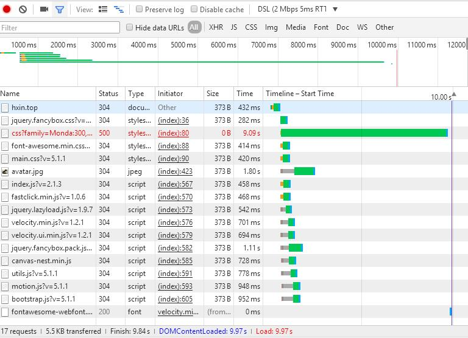

## 摘要 ##
**
chorme开发者工具是一套内置于Google Chrome中的Web开发和调试工具，可用来对网站进行迭代、调试和分析。本文将纤细讲述网络面板，通过使用网络面板了解请求和下载的资源文件并优化网页加载性能
**

## 问题 ##
1. 网络面板长啥样嘞？（往下瞅，或者轻轻地点击F12就可以看到啦）
2. 通过网络面板Network可以了解到哪些信息？
   >Network 面板记录页面上每个网络操作的相关信息，包括详细的耗时数据、HTTP 请求与响应标头和 Cookie，等等（详细讲解往下瞅瞅）

## 网络面板基础 ##
1. Chorme DevTools 的 NetWork面板

**NetWork** 面板记录页面上每个网络操作相关信息，包括详细的**耗时数据、HTTP请求与响应头和Cookie**，等等。

## 了解资源时间轴 ##

## 网络带宽限制 ##