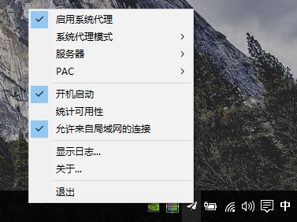
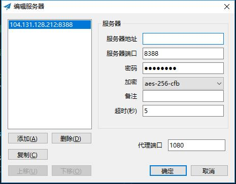

前些天一觉醒来发现VPN突然上不了，商家也是黑心！我交了半年的钱T.T 果然还是Green良心。然后...只能自建服务器翻墙了

本文我只以我的搭建过程为例记录。总共用到的设备和工具：
1. 墙外VPS [Digital Ocean] [Ubuntu 512M  5$/mo ] `选择DO的原因是github有学生优惠` 
2. shadowsocks客户端 [Windows]
3. paypal
4. putty
## 摘要 ##
**准备工具如下：**

**1. VPS一台**
具体想要了解：https://www.zhihu.com/question/20800554
**[购买VPS需要注意的是]**
（1）时差。 否则你购买VPS遇到问题发 Tickets 那边客服不能及时回复
（2）预付费。 国外服务器购买都需要预付 `5美元`,不然是无法激活你的账户的。所以，提前注册号paypal
（3）Digital Ocean 的 `verify` 相当严格，所以一定要认真填写信息，不然有可能人家把你当机器人封号了2333

**2. shadowsocks客户端**
   这个...好像gayhub上全被清了，只能自己想办法下载了

**3. putty**

## 【具体步骤】 ##
**<p style="color:blue;display：block">默认你已经完成以上的准备工作。步骤1-5为服务端的配置，步骤6为客户端操</p>**
**【服务端】**
1. SSH 登陆到位于墙外的服务器
2. 服务端安装ShadowSocks
3. 优化ShadowSocks性能
4. 配置ShadowSocks文件
5. 启动ShadowSocks服务端

**【客户端】**
6. 配置ShadowSocks （Windows）客户端

## 【服务器端】 ##
**这里默认你熟悉Linux的基本使用，有需要的自行查找资料**

### 步骤一 SSH 登陆到位于墙外的服务器 ###
具体步骤请参照这篇文章：http://blog.csdn.net/u010027419/article/details/40679973

### 步骤二 服务端安装ShadowSocks（Ubuntu） ###
```shell
sudo apt-get update

apt-get install python-pip
pip install shadowsocks
```

### 步骤三 优化ShadowSocks性能 ###
1. 创建local.conf配置文件 `vim/etc/sysctl.d/local.conf`
2. 按 `i` 输入：
```shell
# max open files
fs.file-max = 51200  
# max read buffer
net.core.rmem_max = 67108864  
# max write buffer
net.core.wmem_max = 67108864  
# default read buffer
net.core.rmem_default = 65536  
# default write buffer
net.core.wmem_default = 65536  
# max processor input queue
net.core.netdev_max_backlog = 4096  
# max backlog
net.core.somaxconn = 4096

# resist SYN flood attacks
net.ipv4.tcp_syncookies = 1  
# reuse timewait sockets when safe
net.ipv4.tcp_tw_reuse = 1  
# turn off fast timewait sockets recycling
net.ipv4.tcp_tw_recycle = 0  
# short FIN timeout
net.ipv4.tcp_fin_timeout = 30  
# short keepalive time
net.ipv4.tcp_keepalive_time = 1200  
# outbound port range
net.ipv4.ip_local_port_range = 10000 65000  
# max SYN backlog
net.ipv4.tcp_max_syn_backlog = 4096  
# max timewait sockets held by system simultaneously
net.ipv4.tcp_max_tw_buckets = 5000  
# turn on TCP Fast Open on both client and server side
net.ipv4.tcp_fastopen = 3  
# TCP receive buffer
net.ipv4.tcp_rmem = 4096 87380 67108864  
# TCP write buffer
net.ipv4.tcp_wmem = 4096 65536 67108864  
# turn on path MTU discovery
net.ipv4.tcp_mtu_probing = 1

# for high-latency network
net.ipv4.tcp_congestion_control = hybla

# for low-latency network, use cubic instead
# net.ipv4.tcp_congestion_control = cubic
```
3. 退出并保存配置文件：按 `ESC`退出编辑，输入 `:wq` 保存退出
4. 使配置生效：`sysctl --system`

### 步骤四 配置ShadowSocks文件 ###
新建 /etc/shadowsocks.json 配置文件：`vim /etc/shadowsocks.json`
**单用户配置文件Sample**
```shell
{
    "server": "0.0.0.0", // 这里输入本机的 IP 地址
    "server_port": 8388, // 为了安全，可修改为大于1024 的数字
    "local_address": "127.0.0.1",
    "local_port": 1080, // 为了安全，可修改为大于 1024的数字
    "password": "mypassword", // 设置一个密码
    "method": "aes-256-cfb",
    "fast_open": false
}
```
**多用户配置文件Sample**
```shell
{ 
    "server": "0.0.0.0",
    "local_address": "127.0.0.1",
    "local_port": 1080, // 为了安全，可修改为大于 1024的数字
    "local_password": {
        "8388": "yourPassword1",
        "8301": "yourPassword2",
        "7188": "yourPassword3",
        "9090": "yourPassword4",       
    },
    "method": "aes-256-cfb",
    "fast_open": false
}
```

### 步骤五 启动ShadowSocks服务端 ###
**启动服务端**
```shell
ssserver -c /etc/shadowsocks.json -d start
```
**后台停止**
```shell
ssserver -c /etc/shadowsocks.json -d stop
```

**启动并永久运行**
```shell
# ssserver 是 SS 的服务端命令-c 表示以配置文件的方式运行 SS，
# /etc/shadowsocks.json 则是步骤 4 中新建的配置文件的路径。
# -d 表示在后台运行，这样允许用户进行其他操作。start 就是启动。
# nohup 以及最后的 & 是让 SS 服务端一直运行，
# 并把运行日志输出到当前用户主目录下的 nohup.out 文件中。
nohup ssserver -c /etc/shadowsocks.json -d start &
```

## 【客户端】 ##
### 步骤六 配置ShadowSocks （Windows）客户端###
1. 下载 Shadowsocks Windows 客户端 
2. 双击启动 Shadowsocks.exe，随机可以在右下角的系统任务栏看到一个纸飞机的图标，右键纸飞机图标，如图勾选设置：

3. 编辑服务器


连接成功后你就可以愉快的上网啦~~~~

## 【题外话】 ##
如果遇到 500 Internal Privoxy Error 这种问题，首先查日志看看是什么问题，总结大概有一下原因及解决方案
### ping ###
看看你的服务器IP是不是被墙了:http://ping.chinaz.com/

### 权限 ###
以管理员身份运行cmd，执行：
```shell
netsh interface ipv4 reset
netsh interface ipv6 reset
netsh winsock reset
```
然后重启试试

### 防火墙 ###
把防火墙关了试试，确定端口是否被防火墙禁了

### 软件冲突 ###
比如迅雷这种流氓软件的基础组件，你可能要把它们的权限在注册表给禁了。具体自行查资料

### 配置文件出错 ###
如果以上问题都排查之后，那可能就是配置文件出了问题，所以你要详细查一下配置问题是否完全正确

**如果不是以上原因那就放大招：**
**<p style="color:red;display：block">重装！Good Luck ~</p>**


[参考链接]
1.Loyalsoldier:https://www.loyalsoldier.me/fuck-the-gfw-with-my-own-shadowsocks-server/
2.http://blog.csdn.net/u010027419/article/details/40679973