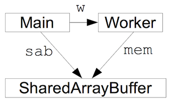

# 吐槽篇（请无视）
感觉ES6的很多特性还没有熟悉，ES8就已经风风火火的来了。最近一直用sf写文章就懒得发到博客上。不过简单一点的记录还是写在博客上比较好，专栏还是有点正式，在博客上还能瞎扯2333 
无语了=.=这两天重装系统啥都没了，找了半天 GitShell 才反应过来。最气的是有几个很久之前的本地仓库丢了...因为里面新的内容还没更新上去，要被气吐血... 实验室的网半小时屏一次我的 vps 每次搜索简直要疯掉，然后又是各种折腾，浏览器从每半天检验人机变成了每搜索一次就检验=.= 还有就是摄像头依然没好。我... 不就是调用了个API嘛，手动微笑脸 
=================== 吐槽完毕 =========================

言归正传，这篇文章主要是记录下ES8的共享内存和原子操作

#共享内存和原子操作
##共享内存
是允许两个不相关的进程访问同一个逻辑内存。不同进程之间共享的内存通常安排为同一段物理内存。进程可将同一段共享内存连接到它自己的地址空间中，所有进程都可以访问共享内存中的地址，就好像它们是由用C语言函数malloc分配的内存一样。而如果某个进程向共享内存写入数据，所做的改动将立即影响到可以访问同一段共享内存的任何其他进程。

##原子操作
原子（atom）本意是“不能被进一步分割的最小粒子”，谓原子操作是指不会被线程调度机制打断的操作；这种操作一旦开始，就一直运行到结束，中间不会有任何 context switch （ 换到另一个线程）。


js是单线程的但运行环境（浏览器）是多线程，不过js为解决并行问题采用的是 **eventloop-worker**模式，js VM碰到文件、网络I/O之类的并发执行的任务时，会开启一个worker去实际执行，当worker执行结束后，把事件放到主队列中。
后面引也就入了webWorker标准，但是问题总是相对的，webWorkerde 引入解决了单线程的问题耗时长，失去响应的问题但是导致了大量数据的开销，所以：

ES8中引入了一种新的 **共享内存的类型 ： SharedArrayBuffer**,和ES6中的ArrayBuffer很像（虽然我没在实际开发中用到=.=）两者最大的区别是：SharedArrayBuffer对应的内存可以被多个代理者同时引用（代理者可以是网页的主程序，也可以是其中一个 web worker）。使用PostMessage在两个代理者之间传递SharedArrayBuffer就会触发共享。举个例子：
```js
let sab  = new SharedArrayBuffer(1024)
let woker = new Woker("...")
woker.postMessage(sab,[sab])    //传递buffer
```
Worker 会通过消息收到被共享的数据：
```js
let mem
onmessage = function (ev) { mem = ev.data; }
```


一旦SharedArrayBuffer被共享，所有引用它的代理人都可以创建一个TypedArray视图并使用标准的数组操作来读写这块内存。假设 worker 做了下面的操作：
```js
let ia = new Int32Array(mem)
ia[0] = 37
```

如果主程序在 worker 写入之后读取第一个元素，它会看到那里写着“37”。

那么，要怎么让主程序“等待 worker 写入”呢？如果多个代理人随意读写同一块内存，那就乱套了。我们需要一套全新的原子操作，从而保证程序对内存的操作按照预定的顺序发生，不会出岔子。**原子操作**是一组静态方法，存放在一个新的顶层Atomics对象中。

ps:原子操作已经引入了，锁机制怕是也不远了=.= 本来js没有复杂的锁机制也是优点之一吧，这样一来反而有点看不懂了 （唔...还是自己学习的太浅了）
不过要操作多核，并行程序中如果让两个worker互相等待不就**死锁了**


#参考资料

[初探新的 JavaScript 并行特性](http://www.zcfy.cc/article/a-taste-of-javascript-s-new-parallel-primitives-274.html)